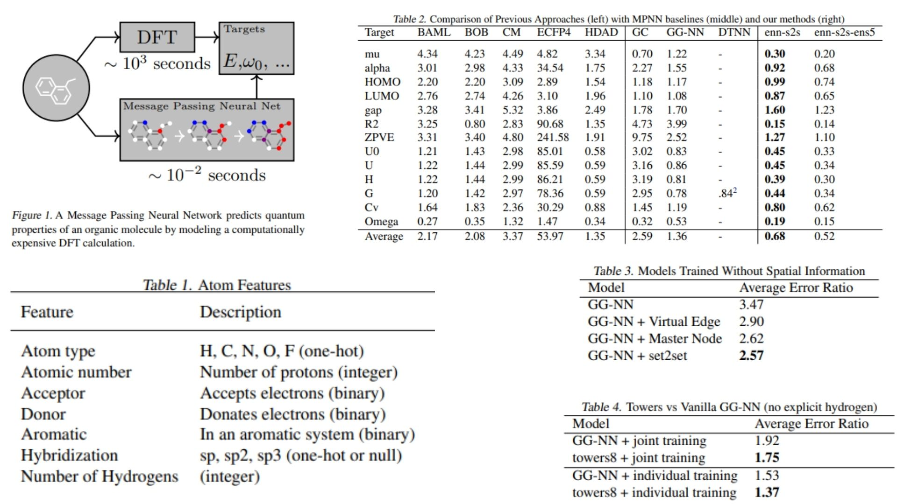

# 📸 MPNN-Replication — Message Passing Neural Networks for Molecular Graphs

This repository presents a **clean PyTorch replication of a Message Passing
Neural Network (MPNN)** for molecular property prediction.

The goal is **architectural clarity rather than benchmark chasing**:
to translate the core ideas of molecular graph message passing into a
minimal, readable implementation that highlights how information flows
between atoms, bonds, and whole-molecule representations.

**Paper reference:**  [Neural Message Passing for Quantum Chemistry (Gilmer et al., 2017)](https://arxiv.org/abs/1704.01212)


---

## ✧ Overview — Molecules as Graphs



A molecule can naturally be represented as a graph:

- atoms → nodes  
- chemical bonds → edges  
- molecular properties → graph-level targets  

Instead of handcrafted descriptors, MPNNs learn representations directly
from structure by iteratively exchanging information between neighboring
atoms.

This allows the model to capture:

- local chemical environments  
- long-range structural effects  
- molecular properties  

within a unified neural framework.

---

## ⚛️ Graph Formalism

Given a molecular graph:

$$
G = (V, E)
$$

with node features:

$$
h_v^0 \in \mathbb{R}^d
$$

and edge features:

$$
e_{uv} \in \mathbb{R}^k
$$

message passing proceeds iteratively.

---

## ⌬ Message Passing Phase

For each iteration $t$:

### Message construction

$$
m_v^{t+1} =
\sum_{u \in \mathcal{N}(v)}
M_t(h_v^t, h_u^t, e_{uv})
$$

where:

- $M_t$ is a learnable message function  
- $\mathcal{N}(v)$ denotes neighbors of node $v$

### Node update

$$
h_v^{t+1} =
U_t(h_v^t, m_v^{t+1})
$$

In this replication:

- message aggregation is sum-based  
- node updates use a GRU-style recurrent unit  

This enables stable iterative refinement of atomic states.

---

## 🜁 Readout Phase — From Atoms to Molecules

After $T$ message passing steps:

$$
y = R(\{h_v^T \mid v \in G\})
$$

A gated readout layer aggregates node embeddings into a
single molecular representation used for prediction.

This stage determines how local atomic interactions translate
into global chemical properties.

---

## 🧪 Application Context

MPNNs are particularly effective for:

- quantum chemistry property prediction  
- molecular energy estimation  
- drug discovery screening  
- materials informatics  

Their strength comes from learning directly from relational
structure instead of fixed descriptors.

---

## 🗂 Repository Structure

```bash
MPNN-QC-Replication/
├── src/
│
│   ├── mpnn/
│   │   ├── message_functions.py
│   │   ├── update_functions.py
│   │   ├── readout_functions.py
│   │   └── mpnn_core.py
│
│   ├── chemistry/
│   │   ├── atom_features.py
│   │   ├── bond_features.py
│   │   └── graph_builder.py
│
│   ├── config.py
│   └── pipeline.py
│
├── images/
│   └── figmix.jpg
│
├── requirements.txt
└── README.md

```
---


## 🔗 Feedback

For questions or feedback, contact: [barkin.adiguzel@gmail.com](mailto:barkin.adiguzel@gmail.com)
